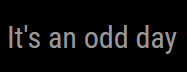
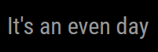

# MMM-OddEven

This is a module for the [MagicMirror²](https://github.com/MichMich/MagicMirror/) that shows something on odd, even, or both, days.

 

## Why?
I have 2 kids, and they swap chores.  We decided on odd and even days, each kid being assigned...odd or even days (of the month).  The obvious problem is
there are 7 (sometimes 8) months with odd lengths of days (Jan, sometimes Feb, Mar, May, July, Aug, Oct, Dec), which results in uneven distribution of chores.

All this does is show a label on odd, even, or both, days of the _year_.

Of course there's still the issue of day 365 -> day 1 having two consecutive 
odd days.  There's a config option for that, too :) 

## How?
### Manual install

1. Clone this repository in your `modules` folder:
  ```bash
  cd ~/MagicMirror/modules # adapt directory if you are using a different one
  git clone https://github.com/daterrell/MMM-OddEven.git
  ```
2. Add the module to your `config/config.js` file (reference [configuration options](#configuration-options))
  ```js
  {
    module: 'MMM-OddEven',
    position: 'bottom_center',
    config: {
        // See configuration options
    }
  },
  ```

## Configuration options
*Note*: if neither `odd` nor `even` is populated, the module will remain hidden.  If `format` is empty, the `odd` or `even` text will be displayed without any formatting.

| Option           | Description |
| ---              | --- |
| `position`       | *Required* Where do you want to place the counter (use standard magicmirror positions) |
| `format`         | *Optional* How to format the text, e.g. "It is %s's day" | 
| `odd`            | *Optional* Label to show on odd days |
| `even`           | *Optional* Label to show on even days |
| `startDate`      | *Optional* Start date to begin counting from (otherwise use day of year) |
